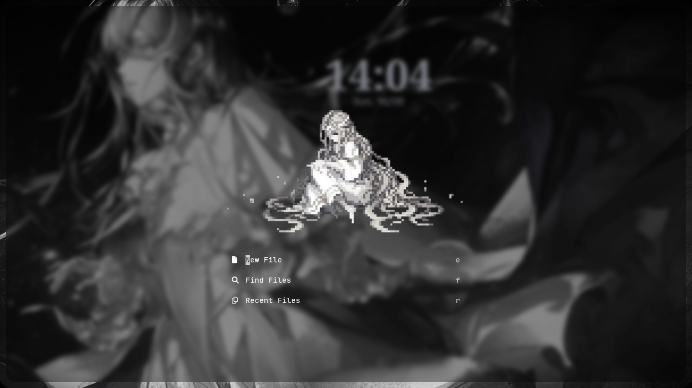
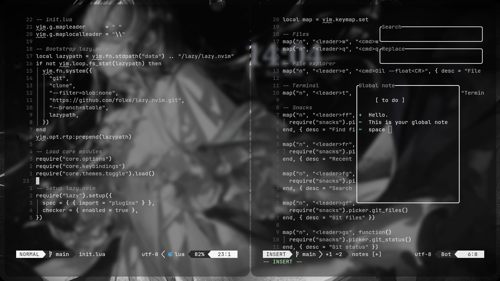

# Nocturne Vim

A calm, minimal Neovim setup, structured for a quiet and focused workflow.

 

 The color scheme can be toggled to the default using `<leader>tt`.

# ✦ Features

# ✦ Requirements

# ✦ Installation
